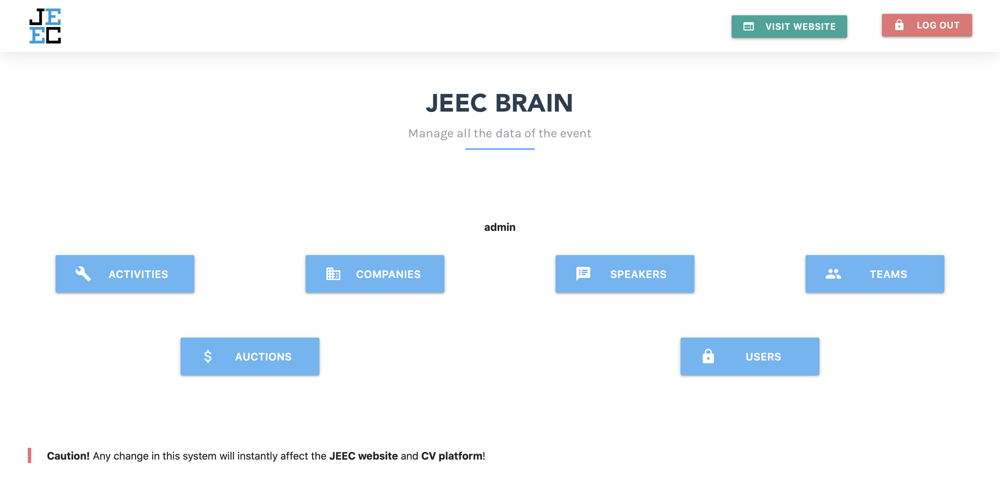
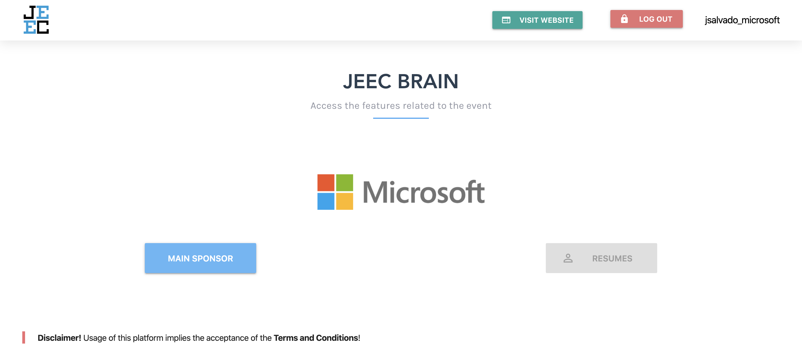
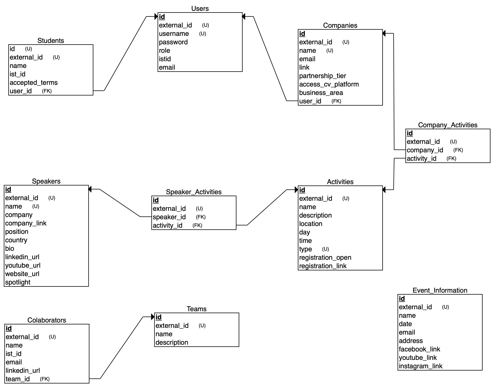

<p align="center">
  
</p>

### Table of contents
- [What is this?](#what-is-this)
- [Administration App](#administration-app)
    - [Features:](#features)
- [Companies App](#companies-app)
    - [Features:](#features-1)
- [Website Api](#website-api)
- [Tech Stack](#tech-stack)
- [Instructions to deploy locally](#instructions-to-deploy-locally)
  - [Creating the database](#creating-the-database)
  - [Configuring the secrets](#configuring-the-secrets)
  - [Deploying using Docker:](#deploying-using-docker)
  - [Deploying the app manually:](#deploying-the-app-manually)
- [Database Model](#database-model)
- [Running migrations](#running-migrations)
- [Authentication](#authentication)
    - [Authentication in Admin platform:](#authentication-in-admin-platform)
    - [Authentication in Companies App:](#authentication-in-companies-app)
    - [Authentication Website <-> Website API:](#authentication-website---website-api)
- [Useful links](#useful-links)

## What is this?
Welcome to the **Brain**! This system serves the purpose of managing
all the technological services of an event, and serving both the applications for companies and attendees.

It includes an Administration Dashboard were a user can access in order to **list/add/edit/delete** companies, speakers, activities, teams and colaborators.

The system consists of **3 main REST API's**
- **Administration API**
- **Companies API**
- **Website API**

## Administration App
This is were the requests to the administration endpoints are managed, which focuses on the creation, editing, deletion and listing of data related to the event.

<kbd>

</kbd>

#### Features:
**Companies**: 
- `list/add/edit/delete` companies;
- search companies;
- upload company **logo**;
- set **partnership levels** which include `main_sponsor/gold/silver/bronze`;

**Speakers**:
- `list/add/edit/delete` speakers;
- search speakers;
- upload speaker **image**;
- set **spotlight speakers** which will be instantly included in the homepage of the website

**Teams**:
- `list/add/edit/delete` teams;
- search teams;
- `list/add/edit/delete` team members;
- search team members;
- upload team member **image**;

**Activities**: (workshops, tech talks, panel discussions, presentations, job fair, matchmaking)
- `list/add/edit/delete` different types of activities;
- search activities (by type, name);

**Auctions**
- `list/add/edit/delete` auctions;
- `add/remove` auction participants

**Users**: 
- `list/add/delete` admin platform users;
- `list/add/delete` company app users;
- search users

Available admin platform **user roles**:
- `admin`: has permission to access, add, edit and delete every data in the platform;
- `companies_admin`: has permission to access activities, teams, speakers and companies, but only edit, add and remove companies;
- `speakers_admin`: has permission to access activities, teams, speakers and companies, but only edit, add and remove speakers;
- `teams_admin`: has permission to access activities, teams, speakers and companies, but only edit, add and remove teams;
- `activities_admin`: has permission to access activities, teams, speakers and companies, but only edit, add and remove activities;
- `viewer`: only has permission to view activities, teams, speakers and companies.


## Companies App
This API serves the companies app.

<kbd>

</kbd>

#### Features:
**Auctions**

Companies are able to access auctions that they are registered in.
This dashboard allows to bet in the auction, check the participants and list the bets that this company made.

**Resumes**

Companies have access to the resumes submited by students. This dashboard allows to download them.


## Website Api
This endpoints are used to present data to the [JEEC website](https://www.jeec.ist). The website requests the companies, speakers, activities and teams data to this API.

Includes endpoints to:
- `GET` speakers
- `GET` activities
- `GET` companies
- `GET` teams

All the **endpoints support search parameters**, so for instance, a request can be made as:

`GET` `/website/speakers?spotlight=False`

and only the spotlight speakers will be requested. This **enables search queries** to the endpoints using different variables.


## Tech Stack
*   Python 3.6
*   Flask
*   PostgreSQL


## Instructions to deploy locally
### Creating the database
1. Clone this repository;
2. Install PostreSQL;
3. Run the database service with:
    - `sudo service postgresql start`
3. Create a new role in postgresql with all privileges:
    - `sudo -u postgres -i`
    - `psql postgres`
    - `CREATE ROLE '<your-computer-account-username>' WITH PASSWORD '<password>'`
    - `GRANT ALL PRIVILEGES ON SCHEMA public TO ROLE '<your-computer-account-username>'`
    - `\q`
    - `exit`
4. Create a database in postgresql for the application:
    - `psql postgres`
    - `CREATE DATABASE brain;`

### Configuring the secrets
1. Create a file in the root of the project named ".env" and fill in the missing variables:
    ```
        SECRET_KEY=somethingsomethingkey21313
        APP_ENV=development
        FLASK_DEBUG="True"

        # Database (update APP_DB with the name of your database)
        APP_DB = 
        DATABASE_URL = "postgresql:///"

        # File submission
        CV_SUBMISSION_OPEN = "FALSE"
        UPLOAD_FOLDER = '/jeec_brain/storage/'
        
        # Credentials required to access the Website API
        CLIENT_USERNAME = 
        CLIENT_KEY = 
    ```

### Deploying using Docker:
- `docker build --tag brain:latest .`
- `docker run -p 8081:8081 --name brain_1 -d brain:latest`

### Deploying the app manually:
1. Create virtual environment and install required dependencies with:
    - `python3.6 -m virtualenv venv`
    - `source venv/bin/activate`
    - `python3.6 -m pip install -r requirements.txt`

3. Ask Devs for the fenixedu.ini file and insert it in the root of the project

4. Migrate the database with:
    - `python3.6 manage.py db init`
    - `python3.6 manage.py db migrate`
    - `python3.6 manage.py db upgrade`
  
5.  Create a new amin user:
    - `python3.6 manage.py create_user --username johndoe --role admin`
    - The script then prints the password of the user.

6.  Deploy the Flask application using Gunicorn with:
    - `exec gunicorn --config deployment/gunicorn_config.py manage:app`


The application runs on port **8081**.


## Database Model



## Running migrations
1. Data migrations are ran using the commands:
    - `python manage.py db migrate`
    - `python manage.py db upgrade`


## Authentication

The **Administration API** and the **Companies API** use session Authentication, implemented by *flask_login* library and cache. 
**Users must be created in the database**, and then provide their username and password to acess the system.

#### Authentication in Admin platform:
Management users are added in the admin users dashboard. Passwords are generated automatically.

- **Roles:**
Each user has a role in the system, which will define the actions that this user is allowed to perform.

#### Authentication in Companies App:
Company users must be added in the Admin platform. The company of the user must be provided, as long as the username. Passwords are automatically generated.

#### Authentication Website <-> Website API:
When it comes to **Website API**, the autentication used is **BasicAuth**. So, we set the credentials in the .env file, and the website must provide this credentials in the headers of the requests, in order to get authenticated and be able to access the data.

## Useful links
* Article about the Single Responsability Principle which is the main design pattern that this code follows - https://medium.com/unbabel/refactoring-a-python-codebase-using-the-single-responsibility-principle-ed1367baefd6
* Flask Documentation - http://flask.pocoo.org/docs/1.0/
* The most complete Flask Tutorial ever - https://blog.miguelgrinberg.com/post/the-flask-mega-tutorial-part-i-hello-world
